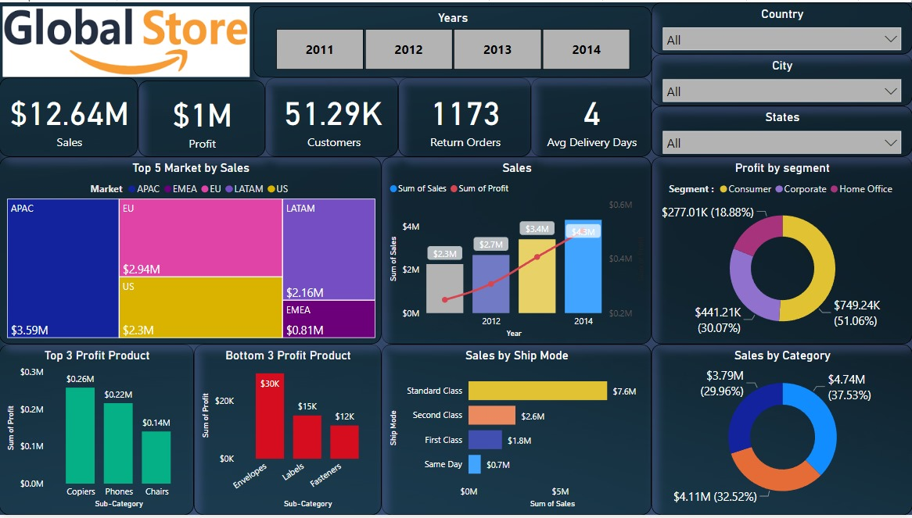

# 🌍 Global Superstore Sales Analysis Dashboard

  

---

## 📌 Project Overview

This project presents an interactive **Power BI dashboard** built using the Global Superstore dataset. It analyzes sales, profit, customer segments, shipping performance, and regional business performance to help identify trends and support business decision-making.

---

## 🎯 Business Objective

The objective of this project is to analyze global retail operations by identifying high-performing markets, profitable products, customer segments, shipping methods, and sales trends through interactive business intelligence dashboards.

---

## 🛠️ Tools & Technologies

- Power BI
- Power Query
- DAX
- Microsoft Excel

---

## 📈 Key Performance Indicators (KPIs)

- 💰 Total Sales
- 💵 Total Profit
- 👥 Total Customers
- 📦 Return Orders
- 🚚 Average Delivery Days

---

## 📊 Dashboard Features

- Year-wise Interactive Filter
- Country, State & City Filters
- Sales vs Profit Trend
- Top Markets by Sales
- Profit by Customer Segment
- Sales by Product Category
- Sales by Shipping Mode
- Top 3 Profitable Products
- Bottom 3 Profitable Products
- Executive KPI Dashboard

---

## 💡 Key Business Insights

- APAC generated the highest overall sales.
- Consumer segment contributed the highest profit.
- Technology category achieved the highest sales.
- Standard Class shipping accounted for the largest share of orders.
- Copiers, Phones, and Chairs were the most profitable products.
- Envelopes, Labels, and Fasteners generated the lowest profits.
- Sales and profits showed steady growth across the selected years.

---

## 🚀 Skills Demonstrated

- Data Cleaning
- Data Modeling
- Power Query
- DAX
- KPI Reporting
- Dashboard Design
- Business Intelligence
- Data Visualization
- Executive Reporting
- Business Insights

---

## 📅 Project Timeline

**Project Type:** Portfolio Project

**Originally Developed:** 2023 *(My first Power BI Dashboard project)*

**Repository Modernized:** 2026

This repository has been updated with improved documentation, project structure, and GitHub best practices while preserving the original dashboard and business analysis.

---

## 👨‍💻 Author

**Shamshad PK**

**Data Analyst | Retail Analytics | SQL | Power BI | Excel | Python**

🔗 LinkedIn: https://linkedin.com/in/pkshamshad10
